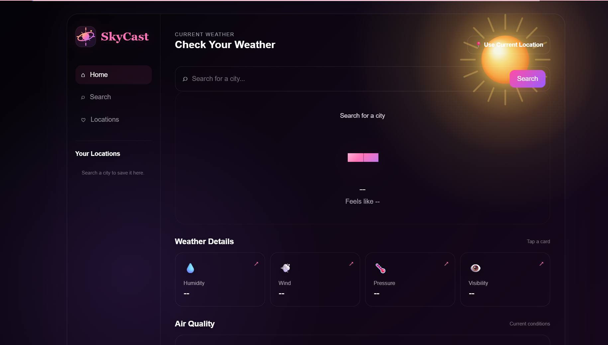
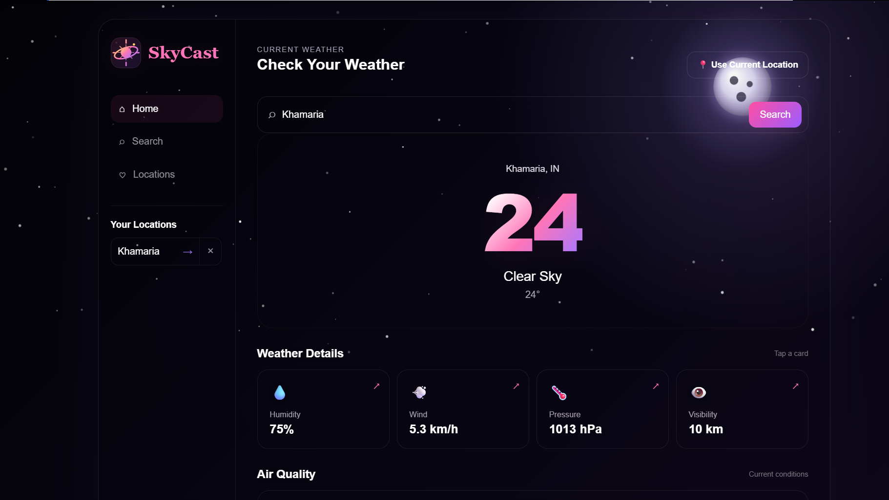
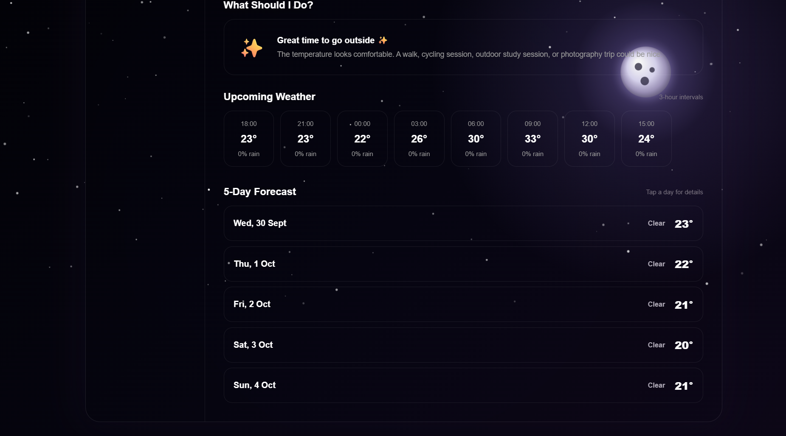
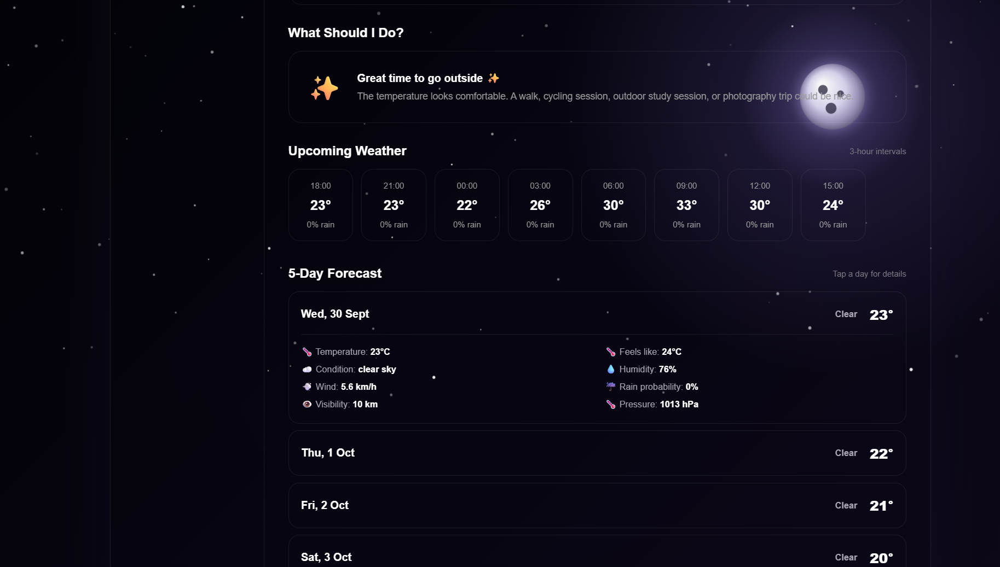
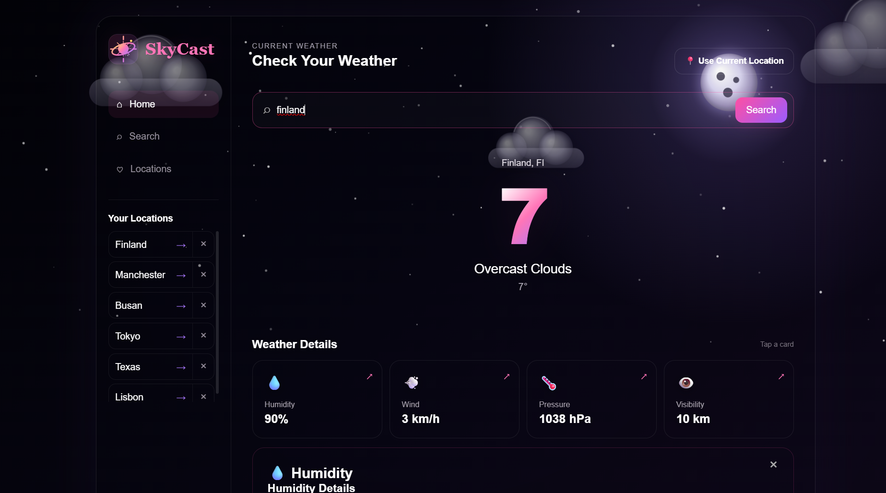

# SkyCast 🌦️

SkyCast is a weather web app I built using Flask, JavaScript, HTML, and CSS.

It uses the OpenWeather API to get weather information for different cities and also supports using the user's current location.

## Screenshots

### Home


### Current Location


### Features


### 5-Day Forecast


### Search


## Features

- Search weather by city
- Use current location
- Current temperature and weather condition
- Feels-like temperature
- Humidity
- Wind speed
- Atmospheric pressure
- Visibility
- Sunrise and sunset
- Moonrise and moonset
- Hourly weather forecast
- Rain probability
- 5-day forecast
- Air Quality Index (AQI)
- Save frequently searched locations
- Responsive design
- Weather-based animated background
- Dark mode

## Tech Stack

**Backend**
- Python
- Flask
- Requests

**Frontend**
- HTML
- CSS
- JavaScript

**API**
- OpenWeather API

## Project Structure

```text
weather_app/
│
├── app.py
├── README.md
├── requirements.txt
├── .gitignore
│
├── static/
│   ├── script.js
│   └── style.css
│
├── templates/
│   └── index.html
│
└── screenshots/
    ├── 01-home.png
    ├── 02-location.png
    ├── 03-features.png
    ├── 04-5-day-forecast.png
    └── 05-searches.png